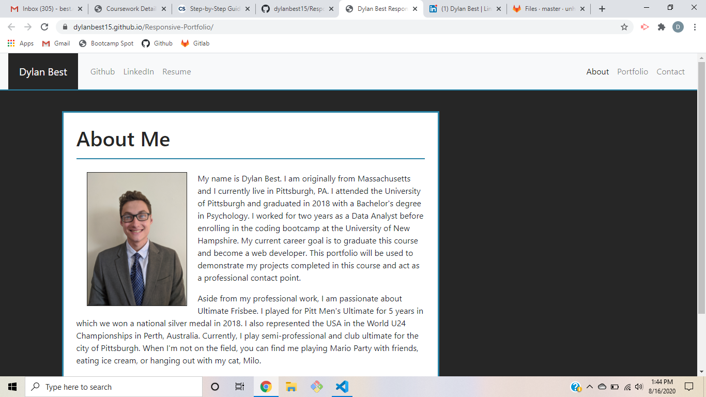

# Responsive-Portfolio
This Responsive Portfolio includes a Navigation Bar through 3 pages: About, Portfolio and Contact. The About Page contains a biography of me with a headshot. The Portfolio page includes 5 applications to choose from to demonstrate different projects that I have completed. The contact page includes a form that the user may fill out if they wish to contact me for professional reasons. All the pages utilizes grid systems as will correctly format with different screen sizings. Each page also contains a footer.

https://dylanbest15.github.io/Homework-2-Responsive-Portfolio/